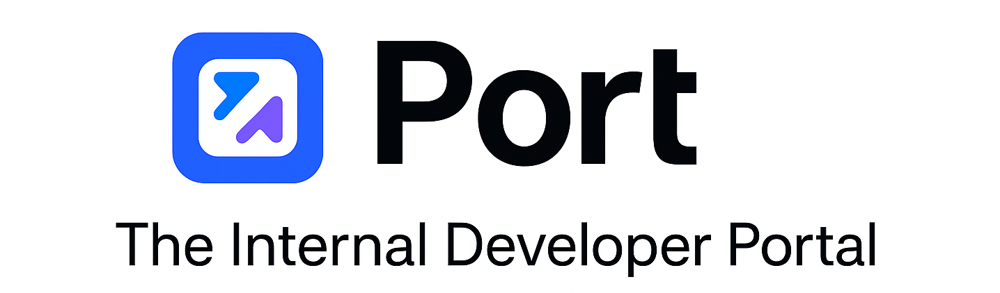

# Port | Internal Developer Portal:-

Greetings and Welcome to __XXXX__.

|  |
| --------- |

| __#__ | __Topics__ |
| --------- | --------- |
| 1. | Implement Example Use Case Visual Diagram. |
| 2. | Generate Port API Token. |
| 3. | Create Github Repo + Repository Secret + Github Fined Grained PAT. |
| 4. | Create Resource Group Port Blueprint. |
| 5. | Create Port Self-Service Actions. |
| 6. | Create Github Actions Workflow. |
| 7. | Create Terraform Code. |
| 8. | Execute Port Self Service Actions. |


| 1. Implement Example Use Case Visual Diagram:- |
| --------- |
|  |

| 2. Generate Port API Token:- |
| --------- |
|  |
|  |

| 3. Create Github Repo + Repository Secret + Github Fined Grained PAT:- |
| --------- |
| __Github Repo:__ https://github.com/arindam0310018/04-June-2025-Platform-Engineering__Test-IDP |
| __Github Repository Secret.__ |
|  |
| __Github Fined Grained PAT.__ |
|  |
|  |

| 4. Create Resource Group Port Blueprint:- |
| --------- |
|  |

__Resource Group Port Blueprint JSON:-__

```
{
  "identifier": "resource-group",
  "description": "This blueprint represents a resource group in Azure",
  "title": "Azure Resource Group",
  "icon": "Azure",
  "schema": {
    "properties": {
      "name": {
        "type": "string",
        "title": "Resource Group Name"
      },
      "location": {
        "type": "string",
        "title": "Location"
      },
      "environment": {
        "type": "string",
        "title": "Environment",
        "enum": [
          "dev",
          "staging",
          "prod"
        ]
      }
    },
    "required": [
      "name",
      "location"
    ]
  },
  "mirrorProperties": {},
  "calculationProperties": {},
  "aggregationProperties": {},
  "relations": {}
}

```

| 5. Create Port Self-Service Actions:- |
| --------- |
|  |
|  |
|  |
|  |
|  |
|  |
| __Github Fined Grained PAT is stored in Port > Credentials > Secrets__ |
|  |
|  |


__Port Self-Service Actions JSON:-__

```
{
  "identifier": "create_azure_resource_group",
  "title": "Create Azure Resource Group",
  "icon": "GithubActions",
  "description": "Self Service - Create Azure Resource Group",
  "trigger": {
    "type": "self-service",
    "operation": "CREATE",
    "userInputs": {
      "properties": {
        "resource_group_name": {
          "icon": "Azure",
          "type": "string",
          "title": "Resource Group Name",
          "description": "Please Provide Resource Group Name"
        },
        "location": {
          "icon": "Azure",
          "type": "string",
          "title": "Location",
          "default": "westeurope",
          "description": "Please Provide Location"
        },
        "environment": {
          "type": "string",
          "title": "Environment",
          "icon": "Azure",
          "description": "Please Select Environment Details",
          "default": "dev",
          "enum": [
            "dev",
            "staging",
            "prod"
          ],
          "enumColors": {
            "dev": "lightGray",
            "staging": "lightGray",
            "prod": "lightGray"
          }
        }
      },
      "required": [
        "resource_group_name",
        "location"
      ],
      "order": [
        "resource_group_name",
        "location",
        "environment"
      ]
    },
    "actionCardButtonText": "Create RG",
    "executeActionButtonText": "Execute Now",
    "blueprintIdentifier": "resource-group"
  },
  "invocationMethod": {
    "type": "GITHUB",
    "org": "arindam0310018",
    "repo": "04-June-2025-Platform-Engineering__Test-IDP",
    "workflow": "port_create-rg.yml",
    "workflowInputs": {
      "{{ spreadValue() }}": "{{ .inputs }}",
      "port_context": {
        "runId": "{{ .run.id }}",
        "blueprint": "{{ .action.blueprint }}"
      }
    },
    "reportWorkflowStatus": true
  },
  "requiredApproval": false
}
```

| 6. Create Github Actions Workflow:- |
| --------- |

port_create-rg.yml:-

```
name: Port - Create Azure Resource Group

on:
  workflow_dispatch:
    inputs:
      resource_group_name:
        description: "Name of the Azure Resource Group"
        required: true
        type: string
      location:
        description: "Azure Region"
        required: true
        type: string
      environment:
        description: "Environment tag"
        required: false
        type: string
      port_context:
        description: "Port run context (optional)"
        required: false
        type: string

permissions:
  contents: read

jobs:
  deploy:
    runs-on: ubuntu-latest
    env:
      ARM_CLIENT_ID: ${{ secrets.ARM_CLIENT_ID }}
      ARM_CLIENT_SECRET: ${{ secrets.ARM_CLIENT_SECRET }}
      ARM_TENANT_ID: ${{ secrets.ARM_TENANT_ID }}
      ARM_SUBSCRIPTION_ID: ${{ secrets.ARM_SUBSCRIPTION_ID }}
      PORT_API_TOKEN: ${{ secrets.PORT_API_TOKEN }}

    steps:
      - name: Checkout code
        uses: actions/checkout@v3

      - name: Setup Terraform
        uses: hashicorp/setup-terraform@v2
        with:
          terraform_version: 1.6.0

      - name: Create tfvars from Port inputs
        run: |
          echo '{
            "name": "${{ github.event.inputs.resource_group_name }}",
            "location": "${{ github.event.inputs.location }}"
          }' > terraform.tfvars.json

      - name: Terraform Init with Remote Backend
        run: terraform init -input=false

      - name: Terraform Apply
        run: terraform apply -auto-approve -var-file="terraform.tfvars.json"

      - name: Report entity to Port
        run: |
          curl -X POST https://api.getport.io/v1/blueprints/resource-group/entities \
          -H "Authorization: Bearer $PORT_API_TOKEN" \
          -H "Content-Type: application/json" \
          -d '{
                "identifier": "${{ github.event.inputs.resource_group_name }}",
                "title": "${{ github.event.inputs.resource_group_name }}",
                "properties": {
                  "name": "${{ github.event.inputs.resource_group_name }}",
                  "location": "${{ github.event.inputs.location }}",
                  "environment": "${{ github.event.inputs.environment }}"
                }
              }'
```

| 7. Create Terraform Code:- |
| --------- |

main.tf:-
```
terraform {
  backend "azurerm" {
    resource_group_name   = "AM-Admin-RG"
    storage_account_name  = "amtfstatesa"
    container_name        = "terraform"
    key                   = "am-rg.tfstate"
  }
}

provider "azurerm" {
  features {}
}

resource "azurerm_resource_group" "rg" {
  name     = var.name
  location = var.location
}
```

variables.tf:-
```
variable "name" {
  type = string
}

variable "location" {
  type = string
}
```


| 8. Execute Port Self Service Actions:- |
| --------- |
|  |
|  |
|  |
|  |
|  |
| __Port's Runs History.__ |
|  |
|  |
| __Resource Group Created successfully.__ |
|  |
| __Terraform State File in Remote Storage Account.__ |
|  |

